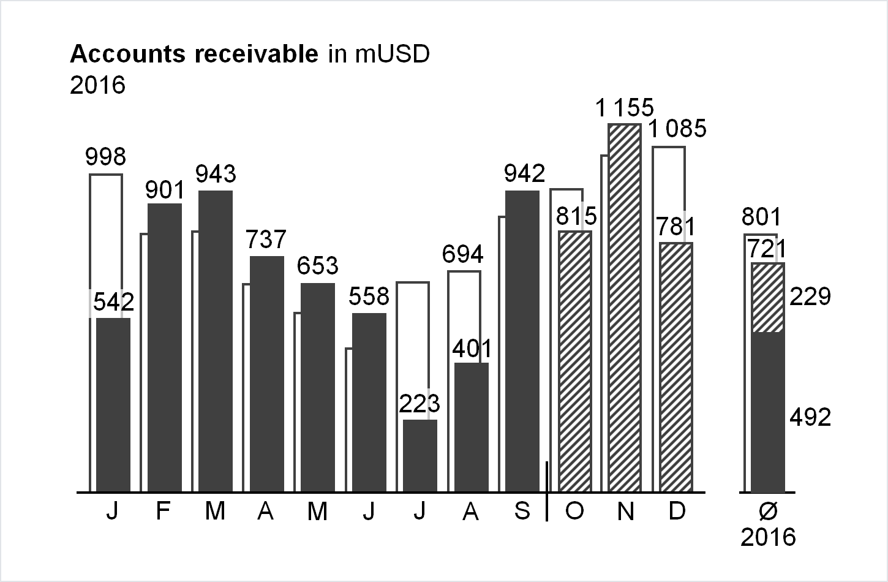

# Data Visualization Guide for Presentations, Reports, and Dashboards

Based on [International Business Communication Standards](https://www.ibcs.com/standards/) 1.1 by [IBCS Association](https://www.ibcs.com/), licensed under [CC BY-SA 4.0](https://creativecommons.org/licenses/by-sa/4.0/). Adapted for the web and other formats by [Anton Zhiyanov](https://antonz.org/).

This is a highly practical and example-based guide on visually representing data in reports and dashboards. It is based on the work of authors such as Barbara Minto, Edward Tufte, and Stephen Few.

The guide consists of seven chapters:

1. [Convey a message](docs/01-say.md)
2. [Organize content](docs/02-structure.md)
3. [Choose proper visualization](docs/04-express.md)
4. [Avoid clutter](docs/05-simplify.md)
5. [Increase information density](docs/06-condense.md)
6. [Ensure visual integrity](docs/07-check.md)
7. [Apply semantic notation](docs/09-unify.md)

Applied together, they will help you to design concise, clear, and actionable reports.

The guide is also available as [EPUB](https://github.com/nalgeon/dataviz/releases/download/1.1/data-visualization-guide.epub) and [PDF](https://github.com/nalgeon/dataviz/releases/download/1.1/data-visualization-guide.pdf).
