# SAY – Convey a message

SAY covers all aspects of conveying messages to the recipients of reports and
presentations.

_Conveying messages_ means that reports and presentations, both as a whole as
well as within their individual components, intend to say something to the
recipients. Messages in this sense can be determinations, explanations,
clarifications, recommendations, and other forms of statements.

This chapter covers introducing, delivering, supporting, and summarizing
messages with respect to the objectives of senders and receivers.

1. [Know objectives](#sa-1-know-objectives)
2. [Introduce message](#sa-2-introduce-message)
3. [Deliver message](#sa-3-deliver-message)
4. [Support message](#sa-4-support-message)
5. [Summarize message](#sa-5-summarize-message)

## SA 1 Know objectives

Good reports (presentations) successfully achieve both the goals of the writer
(speaker) and of the readers (audience).

## SA 1.1 Know own goals

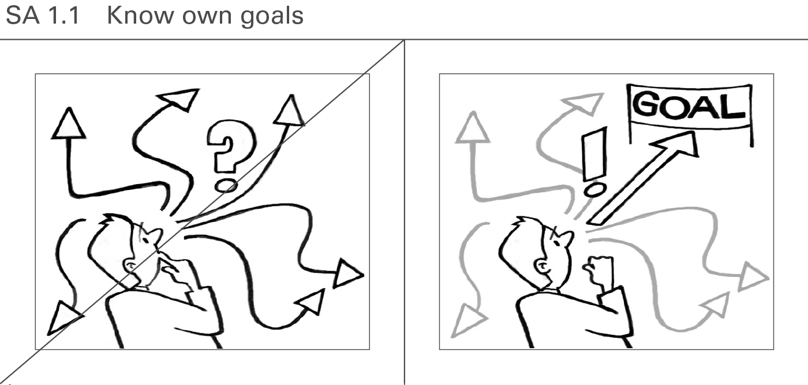

Do not start creating a report or presentation without a clear vision of what to
achieve with it. The least goal is to inform about an interesting detection. A
higher goal is to make the reader (audience) understand a problem by explaining
it. The ultimate goal is to get a decision on a suggestion provided and to cause
corresponding actions.

## SA 1.2 Know target audience

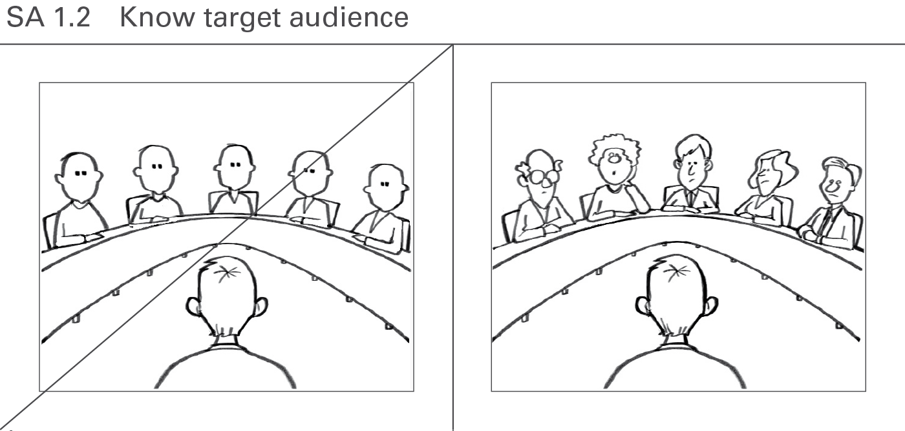

A good report (presentation) will try to answer the questions of the readers
(audience). So it is important to know the target audience (e.g. their function,
position, network, knowledge, experience, attitude, behavior, worries, cultural
background) and their goals, preferences, and expectations.  Do they only want
to get informed about interesting detections, or are they looking for an
explanation to a problem? Are they willing to make decisions and to act
accordingly? Who might object to the message and why?

## SA 2 Introduce message

The addressees appreciate an introduction mapping the actual situation followed
by an explanation of the given problem. Raising a question will focus on the
given message.

## SA 2.1 Map situation

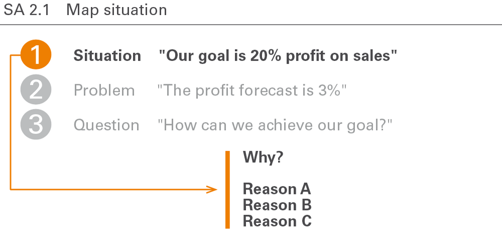

Mapping the situation means compiling and presenting the related facts. Be sure
to cover all relevant aspects and obtain a general consensus concerning the
facts. In general, this means not yet describing the given problem but
presenting facts and goals already known to the reader or audience. It is
advisable to begin with a positive and generally accepted description of the
situation in order to prevent early contradictions.

## SA 2.2 Explain problem

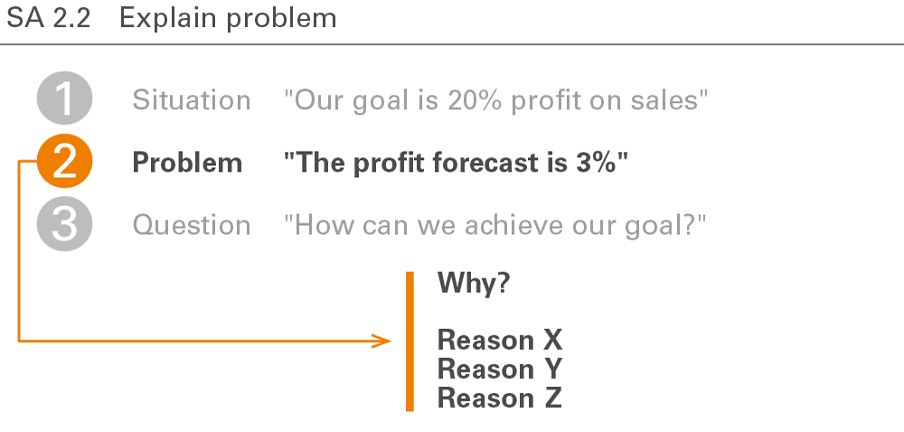

After mapping the situation, introduce the challenge or complication, affecting
the reader or the audience. It should make everyone aware of an interesting,
critical, or even dangerous problem.

## SA 2.3 Raise question

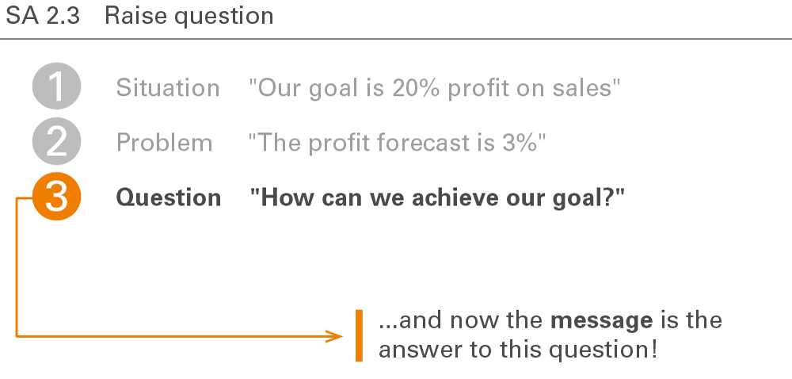

A good introduction raises the relevant question from the perspective of the
recipient of how to solve the complication in the described situation. The
question at the beginning of each report or presentation then leads to the
message, i.e. the answer to the question.

## SA 3 Deliver message

Delivering the message means answering the question asked at the end of the
introduction. Messages detect, explain, or suggest something the report or
presentation later explains in detail.

## SA 3.1 Detect, explain, or suggest

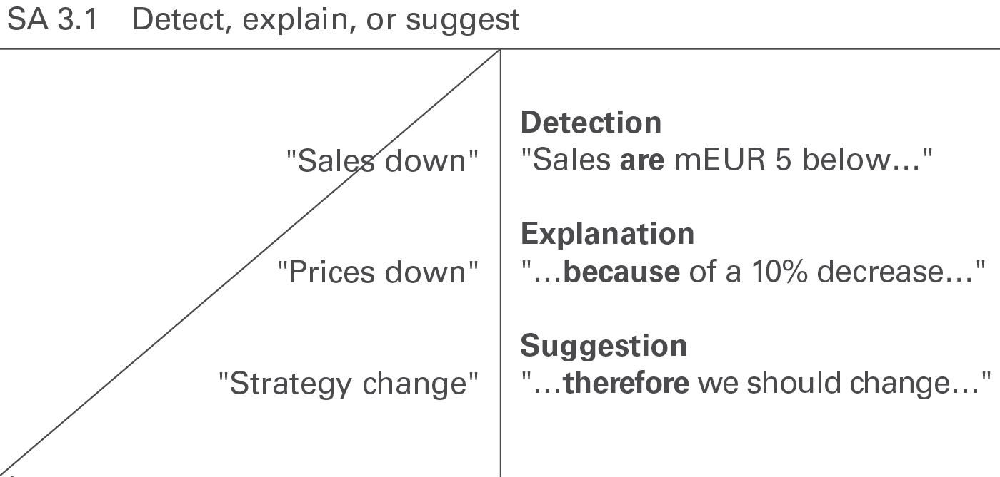

Messages in reports and presentations can detect, evaluate, explain, warn,
complain, threaten, excuse, suggest, or recommend something interesting. Make
sure to deliver these messages in a complete sentence in order to be understood.

Today, many messages in business reporting are pure _detections_. Since
detections are statements that can be checked whether they are true or false,
they should be formulated as precisely as possible.

Explaining the reasons for a detection (_explanation_) or even deriving a
_suggestion_ on how to solve the problem or at least on how to further proceed
can add value.

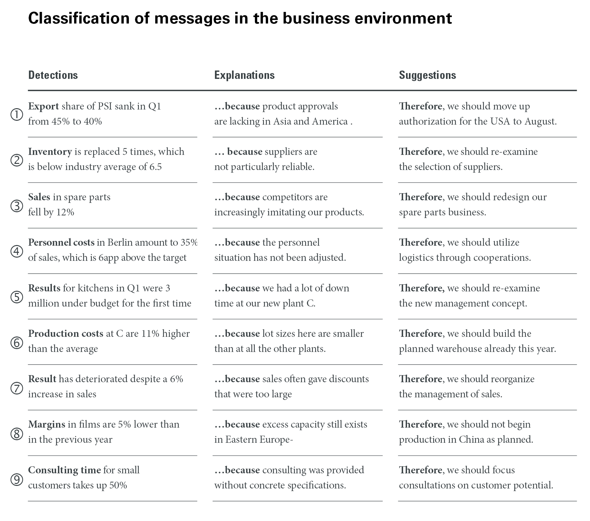

This figure shows a classification of messages with examples from the business
environment (Source: Hichert, R. and Kornwachs, K.)

## SA 3.2 Say message first

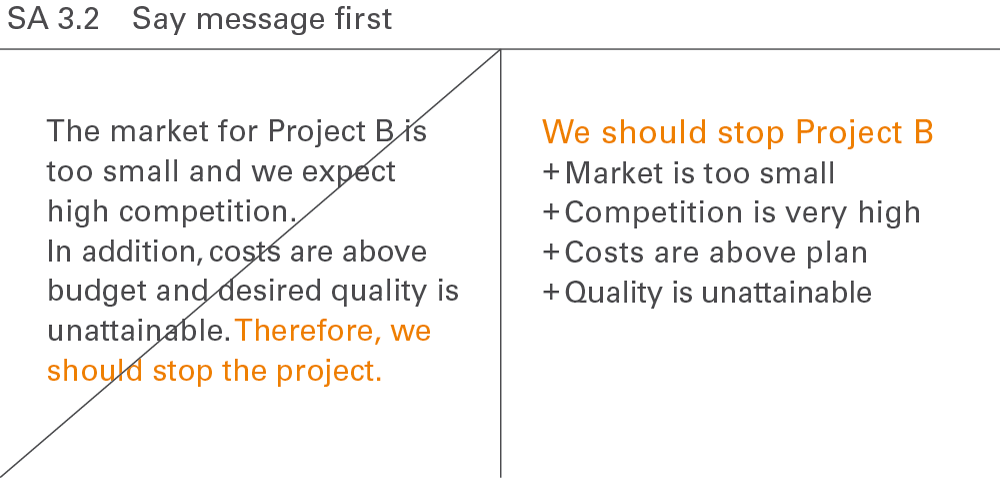

Every report, every presentation, and every single page or exhibit can be summed
up with a clear overall message. This message usually comes first and is proven
afterwards. For the readers or the audience it is more difficult to follow the
storyline if the message comes at the end.

Be cautious applying this rule in presentations (not in reports) with bad,
unexpected, or unpleasant messages (e.g. layoffs) or in a cultural environment,
where directness is considered impolite.

## SA 4 Support message

_Supporting the message_ covers some technical and practical aspects of message
conveyance.

## SA 4.1 Provide evidence

Substantiate the message in order to prove the message by facts and figures. If
possible, a presentation slide should itself explain or prove the speaker’s
message and not – as very often seen in practice – be explained by the speaker.
This can be done by spoken sentences possibly supported by charts, tables, and
pictures.

## SA 4.2 Use precise words

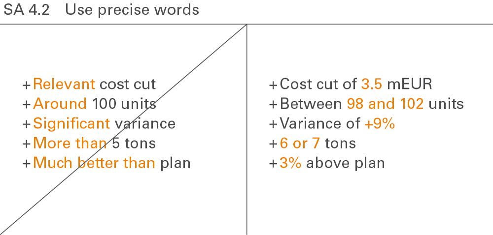

The more unambiguous the language, the clearer the message. Only precise words
will be understood. Speaking about “relevant” or “significant” (in common
speech, not as a statistical term) content leads to misinterpretations and
misunderstandings. Speaking about facts and figures will prevent them.

## SA 4.3 Highlight message

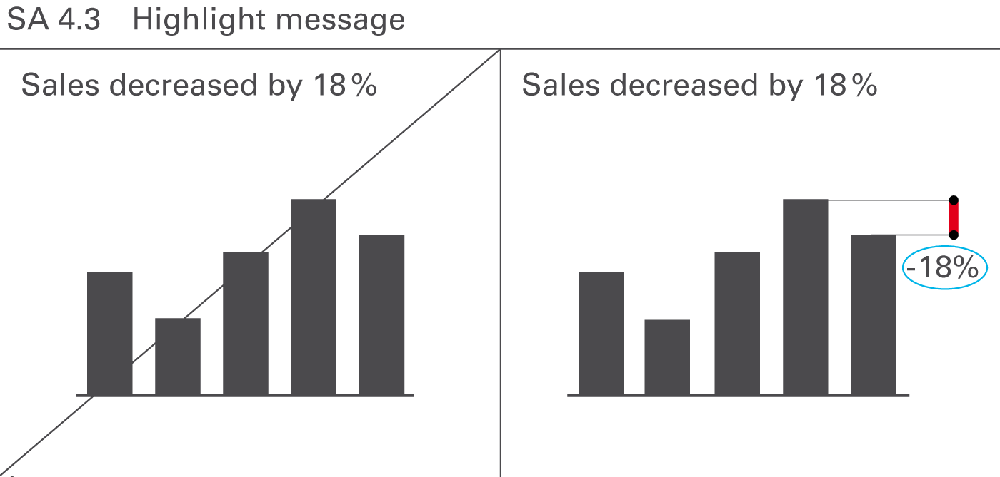

Visually highlight messages in the communication objects presented – namely in
charts, tables, graphs, and pictures. This facilitates comprehension and reduces
the time needed to understand complex situations. In most cases, it should be
possible to highlight the important parts of the content by underlining the most
important facts or emphasizing interesting details. Objects and pages without
highlighting indicators tend to be a statistic rather than a report.

## SA 4.4 Name sources

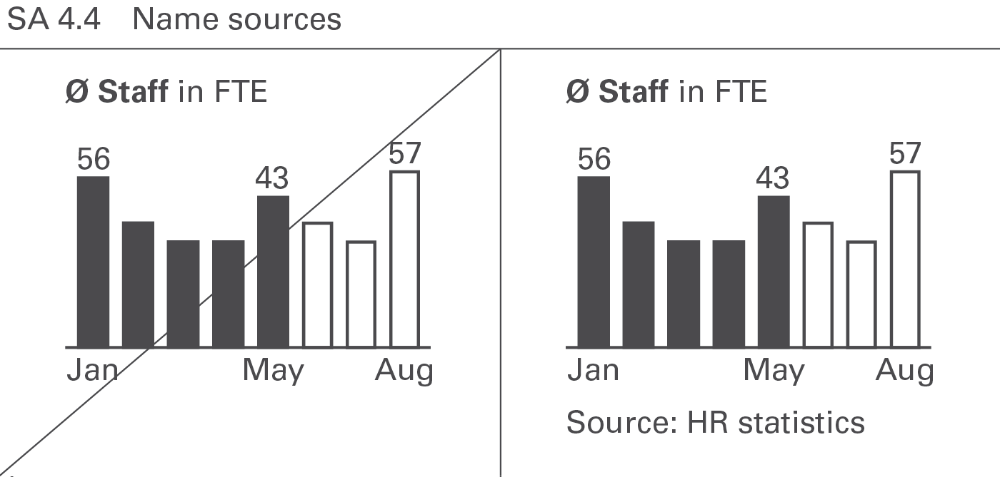

Naming sources for the material presented increases the credibility. Projected
slides can omit them but written reports and handouts must include them.

## SA 4.5 Link comments

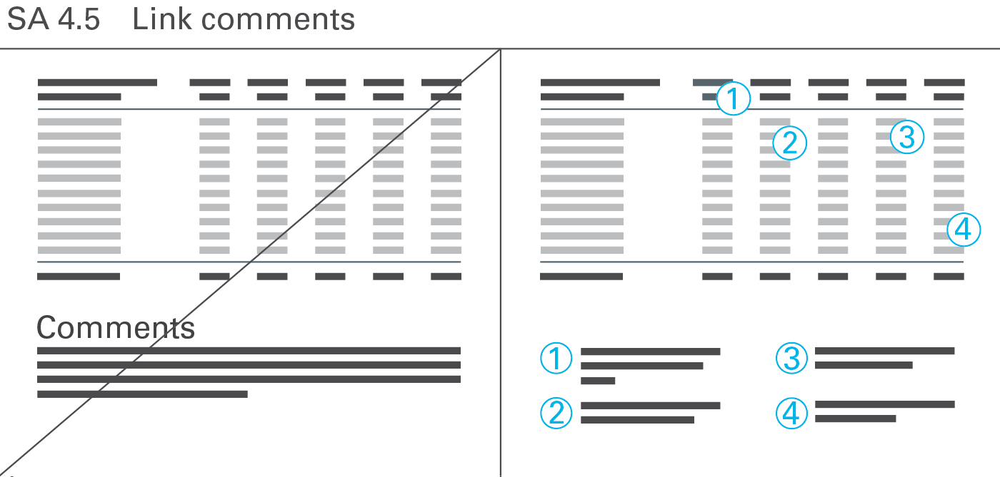

Use comments in written reports and handouts to add explanations, conclusions,
and similar statements. Projected slides in presentations rarely need any
comments because the comments are given by the speaker.

Number comments related to specific parts of a page (e.g. words, numbers, or
visualization elements) and link them to the respective parts. Post numbered
comments in text boxes on free areas of a page. General comments concerning the
whole page are not numbered. Post them as a footnote at the bottom of a page.

## SA 5 Summarize message

Conclude a presentation with the overall message, including the next steps and
an explanation of the consequences.

## SA 5.1 Repeat message

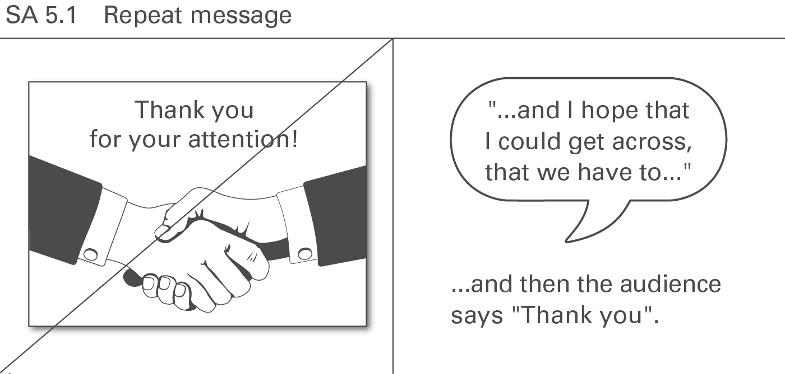

Avoid the phrase “Thank you for your attention” at the end of a presentation.
Instead, presenters should briefly sum up their message one last time – in one
sentence, if possible. At the conclusion of a successful presentation, the
audience will be thanking the presenters for the information. Repeating the
message from the beginning of a presentation at the end helps the audience check
the quality of the storyline and brings the presentation full circle. In
reports, on the other hand, such repetition is not necessary as the reader can
quickly browse back to the respective summary at the beginning.

## SA 5.2 Explain consequences

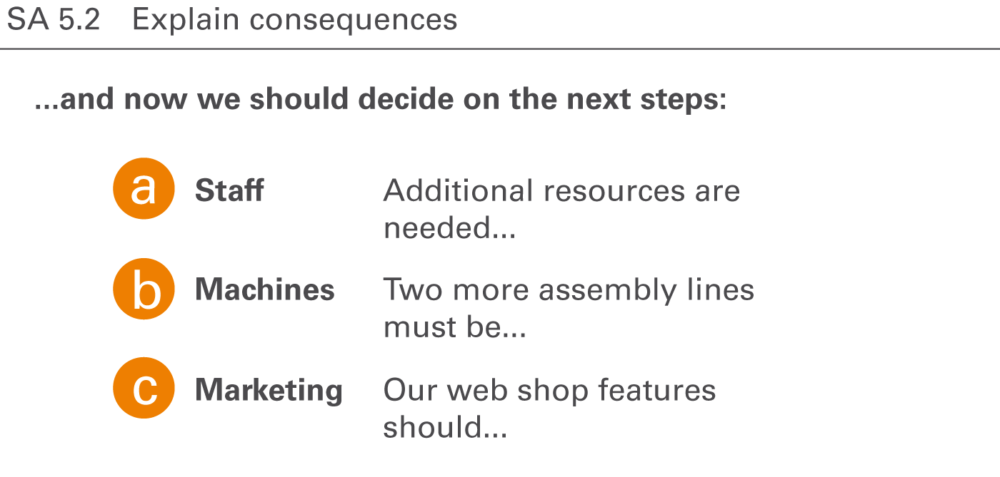

Conclude reports and presentations with proposals for decisions to be taken and
an explanation of their consequences. This is the real objective of a
presentation: Convince the audience of both the message and the suggested steps
to be taken next.

[Organize content →](02-structure.md)
