# SIMPLIFY – Avoid Clutter

SIMPLIFY covers all aspects of avoiding clutter in reports and presentations.

_Avoiding clutter_ means that reports and presentations avoid all components and
characteristics, which are too complicated, redundant, distracting or merely decorative.

This chapter covers avoiding unnecessary and decorative components and replacing them
with cleaner layouts, avoiding redundancies and distracting details.

1. [Avoid unnecessary components](#si-1-avoid-unnecessary-components)
2. [Avoid decorative styles](#si-2-avoid-decorative-styles)
3. [Replace with cleaner layout](#si-3-replace-with-cleaner-layout)
4. [Avoid redundancies](#si-4-avoid-redundancies)
5. [Avoid distracting details](#si-5-avoid-distracting-details)

## SI 1 Avoid unnecessary components

Completely avoid components, such as pictures, backgrounds, and logos, not
contributing to the comprehension of a report or presentation.

## SI 1.1 Avoid cluttered layouts

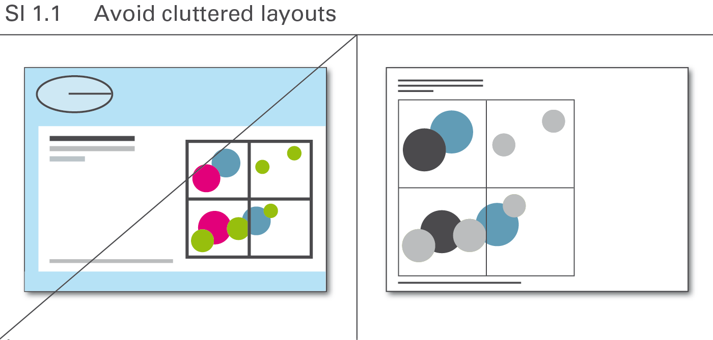

Layout concepts often contain elements that lack meaning but merely
conform to corporate design or personal taste. Avoid all these elements,
see Figure SI 1.1.

## SI 1.2 Avoid colored or filled backgrounds

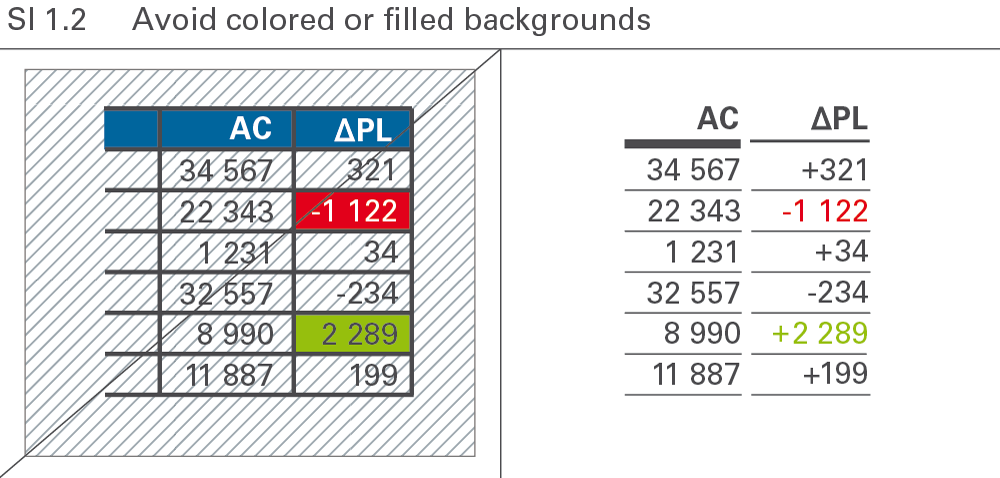

Numbers and labels are easiest to read when depicted in black on a white
background. Any type of background color or pattern makes something
harder to read, see Figure SI 1.2.

## SI 1.3 Avoid animation and transition effects

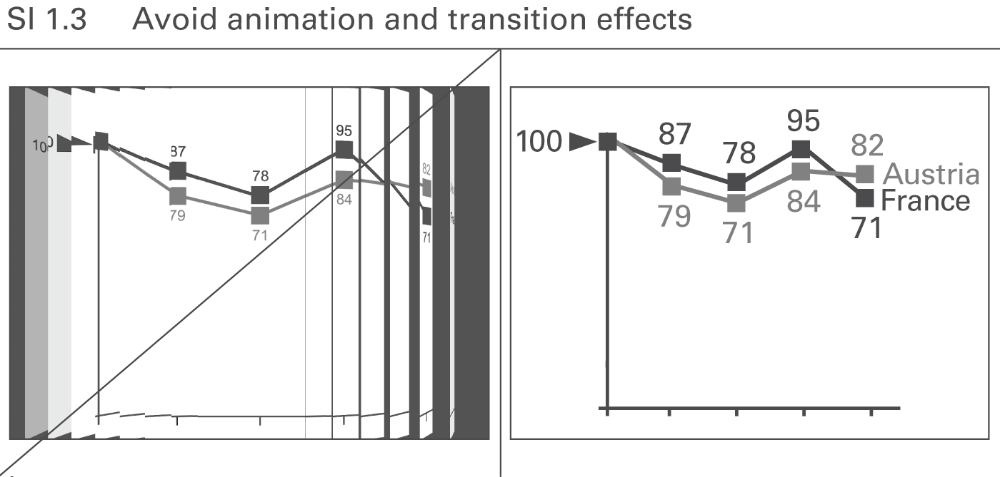

Animated _PowerPoint_ slides are not useful if the animation has
no meaning and does not support the message, see Figure SI 1.3. They
merely distract and confuse. Only the “appear” function is recommended
to be used for the gradual development of a slide.

## SI 2 Avoid decorative styles

Simplify complicated visualizations in order to facilitate and accelerate their comprehension. Whereas the section “Avoid unnecessary components” involves omitting entire layout elements, the aim here is to find the most suitable and simplest possible style of visualization elements.

## SI 2.1 Avoid borders, shades, and pseudo-3D

In general, borders, shades, and pseudo-3D convey no meaning and make
comprehension more difficult. Shades and pseudo-3D might even give a
false visual impression. Avoid them because they do not add value,
see Figure SI 2.1.

## SI 2.2 Avoid decorative colors

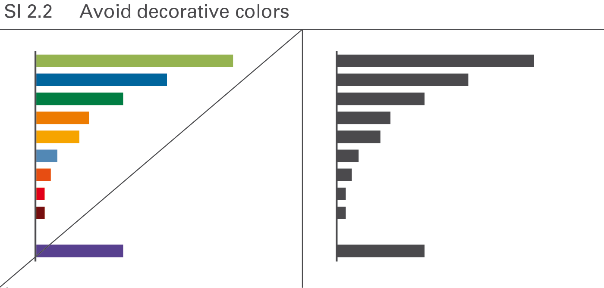

If colors serve merely decorative purpose in one instance, using them for
meaning in another instance (e.g. for highlighting) becomes difficult.
Therefore use colors only if they convey meaning, see Figure SI 2.2.

## SI 2.3 Avoid decorative fonts

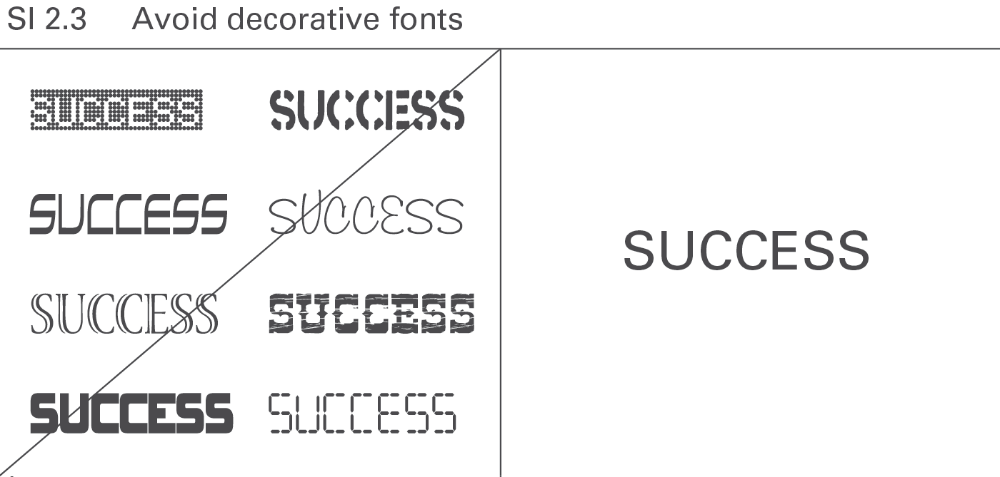

A normal typeface and clear fonts increase legibility. Save bold and
cursive fonts for making distinctions, see Figure SI 2.3.

## SI 3 Replace with cleaner layout

Using a cleaner method of visualization decreases the amount of ink necessary to
convey a message.

## SI 3.1 Replace grid lines and value axes with data labels

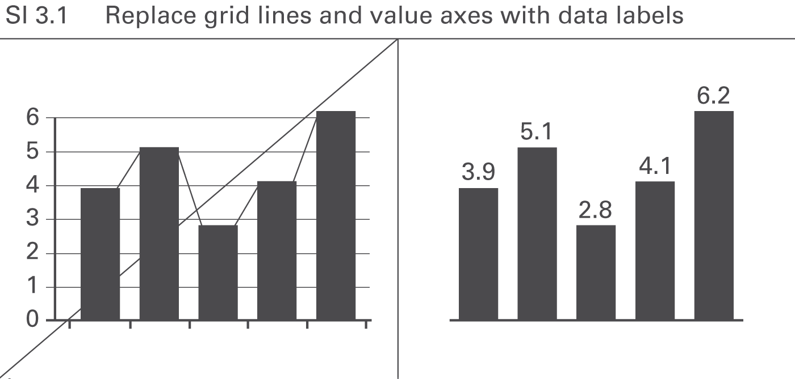

Using integrated data labels can make value axes, tick marks, and
gridlines superfluous, see Figure SI 3.1. Gridlines, however, can
be useful in charts with missing reference points as might be the case
in charts with many data series and data points, or in small charts
(e.g. small multiples).

## SI 3.2 Avoid vertical lines by right-aligning data

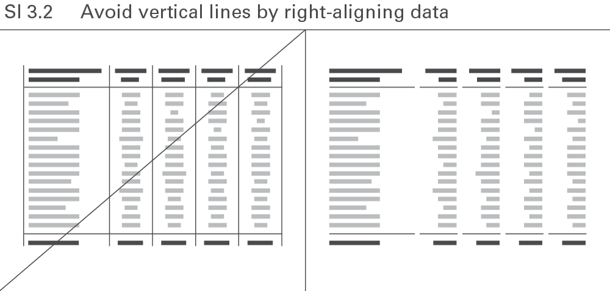

Omit all avoidable elements to make tables more straightforward. Avoid
vertical lines by right-aligning numerical values and the corresponding
column headers, see Figure SI 3.2.

## SI 4 Avoid redundancies

Avoiding redundant terms usually increases the legibility of charts and tables.
In some cases, a certain amount of redundancy can be helpful like when the time
period named in the chart title also appears in said chart. But unnecessary
redundancy impedes comprehension like when naming the year twelve times in a
chart with twelve monthly category labels.

## SI 4.1 Avoid superfluous extra words

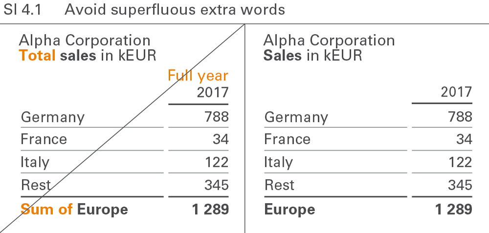

Extra words such as “sum” and “total” are redundant because they add no
value to the meaning of the term they accompany. No difference exists
between “Europe” and “Sum of Europe”. Extra words make it harder to read
text elements, see Figure SI 4.1.

## SI 4.2 Avoid obvious terms

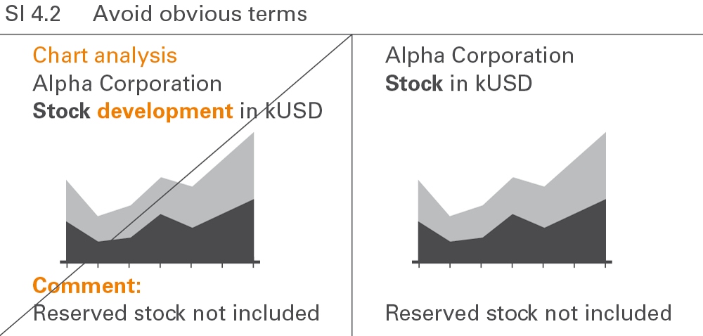

Terms such as “chart analysis”, “development”, or “comment” are redundant
because they name something already shown, see Figure SI 4.2. Other
obvious terms in charts and tables are “table”, “statistics”, “report”,
“visualization”, “structure”, or “trend”.

## SI 4.3 Avoid repeated words

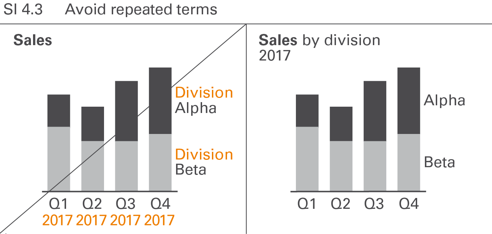

Repeated words in legends, axis labels, row headers, etc. such as
“division” in “division A”, “division B”, etc. or “2017” in “Q1 2017”,
“Q2 2017”, etc. should be avoided, see Figure SI 4.3. Omitting repeated
words usually increases the degree of legibility.

## SI 5 Avoid distracting details

In addition to avoiding noise and redundancy, omitting nonessential, distracting
information details facilitates comprehension. Examples include unnecessarily
large numbers and disproportionately detailed information in project or product
overviews.

## SI 5.1 Avoid labels for small values

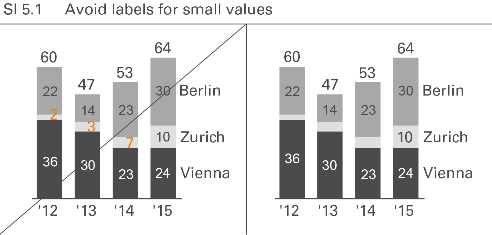

Labels of small values are often hard to position and rarely contribute
to the comprehension of the message. Therefore they can be avoided in
most cases, see Figure SI 5.1. However, add them when special reference
is made to them. If it is necessary to label these small values or small
visualization elements, _assisting lines_ might be necessary.

## SI 5.2 Avoid long numbers

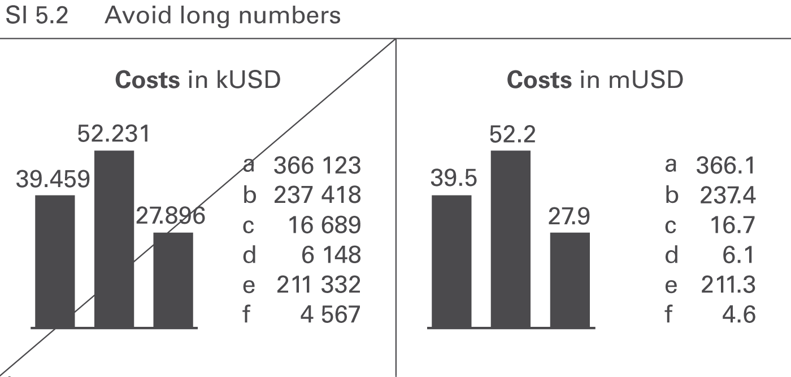

Numbers with more than three digits in charts and four digits in tables
are hard to read; moreover, such precision is seldom necessary to
understand the message, see Figure SI 5.2.

## SI 5.3 Avoid unnecessary labels

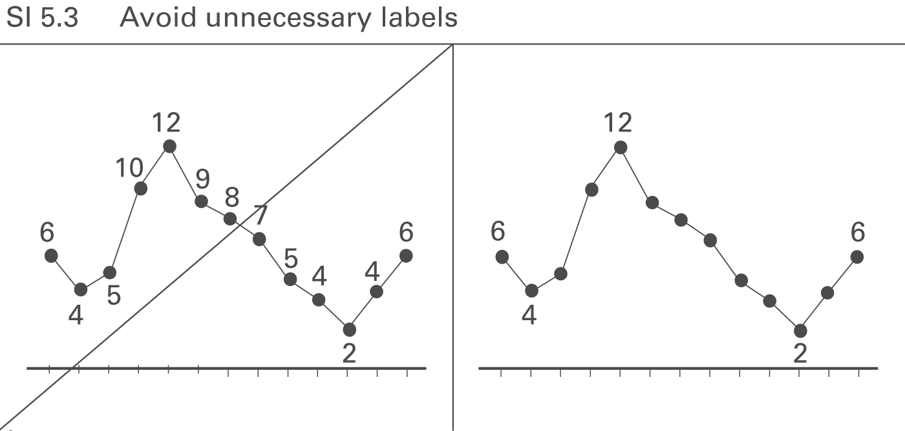

Omit labels for data points that do not represent extreme values or
values of special importance, see Figure SI 5.3.

[← Choose proper visualization](04-express.md) | [Increase information density →](06-condense.md)
